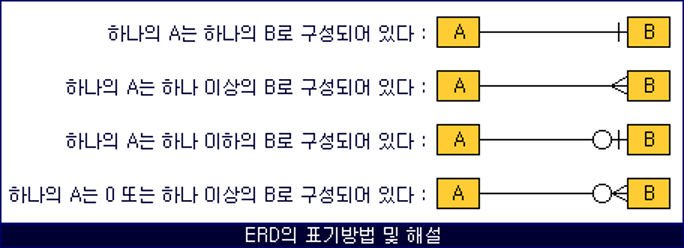

## 3. 데이터 저장 구조 및 I/O 매커니즘: I/O 튜닝이 곧 SQL 튜닝

### SQL이 느린 이유
- I/O = SLEEP
- OS 또는 I/O 서브시스템이 I/O를 처리하는 동안 프로세스는 잠을 잠
- 여러 프로세스(Process: 실행 중인 프로그램)가 하나의 CPU를 공유할 수 있지만, 특정 순간에는 하나의 프로세스만 CPU를 사용할 수 있기 때문.
- 프로세스의 생명주기
 - 생성(new) 이후 종료(terminated) 전까지 준비(ready)와 실행(running)과 대기(waiting) 상태를 반복. [그림1-8]: p37

### 데이터베이스 저장 구조: [그림1-10]: p39

#### 테이블스페이스
- 세그먼트를 담는 콘테이너, 여러 개의 데이터파일(디스크 상의 물리적인 OS 파일)로 구성

#### 세그먼트
- 테이블, 인덱스처럼 데이터 저장공간이 필요한 오브젝트. 테이블, 인덱스를 생성할 때 데이터를 어떤 테이블스페이스에 저장할지를 지정

#### 익스텐트
- 공간을 확장하는 단위: 테이블이나 인덱스에 데이터를 입력하다가 공간이 부족해지면 해당 오브젝트가 속한 테이블 스페이스로부터 익스텐트를 추가로 할당 받음: 익스텐트는 여러 개의 데이터 블록으로 구성됨

#### 데이터 블록
- 사용자가 입력한 레코드를 실제로 저장하는 공간. 한 블록은 하나의 테이블이 독점, 한 익스텐트도 하나의 테이블이 독점

#### 세그먼트에 할당된 모든 익스텐트가 같은 데이터파일에 위치하지 않을 가능성이 높음
- 하나의 테이블스페이스를 여러 데이터파이로 구성하면, 파일 경합을 줄이기 위해 DBMS가 데이터를 가능한 한 여러 데이터파일로 분산해서 저장
- 세그먼트에 할당된 익스텐트 목록 조회(in oracle)
```
select segment_type, tablespace_name, extent_id, file_id, block_id, blocks
from dba_extents
where owner = USER
and segment_name = ‘MY_SEGMENT’
order by extent_id;
```
#### DBA
- Data Block Address: 디스크 상에서 몇 버 데이터파일의 몇 번째 불록인지를 나타내는 자신(데이터 블록)만의 고유 주소값

#### 블록, 익스텐트, 세그먼트, 테이블스페이스, 데이터파일 정의
- 블록
  - 데이터를 읽고 쓰는 단위
- 익스텐트
  - 공간을 확장하는 단위. 연속된 블록 집합
- 세그먼트
  - 데이터 저장공간이 필요한 오브젝트(테이블, 인덱스, 파티션, LOB 등)
- 테이블스페이스
  - 세그먼트를 담는 콘테이너
- 데이터파일
  - 디스크 상의 물리적인 OS 파일
 - ERD의 표기방법 및 해설
  
  
### 블록단위 I/O
- 블록: DBMS 데이터를 읽고 쓰는 단위(oracle은 기본적으로 8KB = 8196BYTE 크기의 블록을 사용)
- 블록 확인 방법
```
SQL> show parameter block_size
V$PARAMETER 뷰 조회
```

```
select value from V$PARAMETER where name =‘db_block_size’
```

### 시퀀셜 액서스 vs. 랜덤 액서스

#### 시퀀셜(Sequential) 액서스
- 논리적 또는 물리적으로 연결된 순서에 따라 차례대로 블록을 읽는 방식. 
- 인덱스 리프 블록은 앞뒤를 가리키는 주소 값을 통해 논리적으로 서로 연결돼 있고, 이 주소 값에 따라 앞 또는 뒤로 순차적으로 스캔하는 방식.
- 오라클은 세그먼트에 할당된 익스텐트 목록을 세그먼트 헤더에 맵(map)으로 관리. 익스텐트 맵은 각 익스텐트이 첫 번째 블록 주소 값을 가짐. 
- 읽어야 할 익스텐트 목록을 익스텐트 맵에서 얻고, 각 익스텐트의 첫 번째 블록 뒤에 연속해서 저장된 블록을 순서대로 읽는 것이 곧 Full Table Scan.

#### 랜덤(Random) 액서스
- 논리적, 물리적 순서를 따르지 않고, 레코드 하나를 읽기 위해 한 블록씩 접근(=touch)하는 방식: [그림1-17]: p47: 점선

### 논리적 I/O vs 물리적 I/O
- DB버퍼캐시
  - 데이터 캐싱 매커니즘 
  - SGA 구성도 - [그림 1-18]: p48
- 코드 캐시
  - 라이브러리 캐시가 SQL과 실행계획, DB 저장형 함수/프로시저 등을 캐싱.
- 데이터 캐시
  - 디스크에서 어렵게 읽은 데이터 블록을 캐싱해 둠으로써 같은 블록에 대한 반복적인 I/O Call을 줄임: 버퍼캐시는 공유메모리 영역이므로 같은 블록을 읽는 다른 프로세스도 득을 보게 함.

#### Oracle SQL Plus에서 버퍼 캐시 사이즈를 확인하는 방법
- V$SGA 뷰를 통해 확인
``` 
SQL> show sga
```
#### 논리적 I/O vs. 물리적 I/O   
1. 논리적 블록 I/O 
   - SQL문을 처리하는 과정에 메모리 버퍼캐시에서 발생한 총 블록 I/O.
   - SQL을 수행하면서 읽은 총 불록 I/O.
2. 물리적 블록 I/O
   - 디스크에서 발생한 총 블록 I/O: 읽어야 할 블록을 버퍼캐시에서 찾지 못할 때만 디스크를 액서스하므로 논리적 블록 I/O중 일부를 물리적으로 I/O로 함.
3. 논리적 I/O vs. 물리적 I/O - [그림 1-20]: p50
 
  ||논리적 I/O|물리적 I/O|
  |--|--|--|
  |액세스 시점 | 블록읽기 요청 | 버퍼 캐시 Miss|
  |I/O Type| 메모리 I/O| 디스크 I/O|
  |동작방식|전기적 신호| 엑세스 ARM|
  |속도||10,000배 늦음|
<br>

4. 블록 I/O 발생량
   - 검색 범위, 조인하는 테이블 개수, 대상 테이블 크기, 인덱스 구조 등에 의해 결정됨

#### 버퍼캐시 히트율(Buffer Cache Hit Ratio, BCHR)
```
BCHR = ( 캐시에서 곧바로 찾은 블록 수 / 총 읽은 블록 수 ) * 100 
    = ( (논리적 I/O – 물리적 I/O) / 논리적 I/O) * 100
    = ( 1 – (물리적 I/O) / (논리적 I/O) ) * 100

``` 
 - 읽은 전체 블록 중에서 물리적인 디스크 I/O를 수반하지 않고 곧바로 메모리에서 찾은 비율.
 - 온라인 트랜잭션을 주로 처리하는 애플리케이션 시스템 목표 BCHR: 99%
 - SQL 성능을 향상하려면 물리적 I/O가 아닌 논리적 I/O의 성능을 줄여야 함
 - 물리적 I/O = 논리적 I/O * (100 – BCHR)
 - 논리적 I/O는 일정하므로 물리적 I/O는BCHR에 의해 결정됨. BCHR은 시스템 상황에 따라 달라지므로 물리적 I/O는 시스템 상황에 의해 결정되는 통제 불가능한 외생변수.

```

EX1) 물리적 I/O = 논리적 I/O * (100 – 70)% = 10,000 * 30% = 3,000
EX2) 물리적 I/O = 10,00 * 30% = 3,00

```
#### 논리적 I/O를 줄이는 방법
- SQL을 튜닝해서 읽는 총 블록 개수를 줄이는 것
- SQL 튜닝을 통해 줄일 수 있는 통제 가능한 내생변수
- 논리적 I/O를 줄임으로써 물리적 I/O를 줄이는 것이 곧 SQL 튜닝
- 블록을 읽을 때는 해당 블록을 먼저 버퍼캐시에서 찾아보고 없을 때만 디스크에서 읽는다. 이때도 디스크에서 곧바로 읽는 게 아니라 먼저 버퍼캐시에 적재하고서 읽는다.

### Single Block I/O vs. Multiblock I/O
#### Single Block I/O
- 한 번에 한 블록씩 요청해서 메모리에 적재하는 방식
- 인덱스를 이용할 때는 기본적으로 인덱스와 테이블 블록 모두(인덱스는 소량 데이터를 읽을 때 주로 사용)
- Single Block I/O 케이스
  - 인덱스 루트 블록을 읽을 때
  - 인덱스 루트 블록에서 얻은 주소 정보로 브랜치 블록을 읽을 때
  - 인덱스 브랜치 블록에서 얻은 주소 정보로 리프 블록을 읽을 때
  - 인덱스 리프 블록에서 얻은 주소 정보로 테이블 블록을 읽을 때

#### Multiblock I/O
- 한 번에 여러 블록씩 요청해서 메모리에 적재하는 방식
- 많은 데이터 블록을 읽을 때 효율적 
- 테이블 전체를 스캔할 때
- 읽고자 하는 블록을 DB 버퍼캐시에서 찾지 못하면 해당 블록을 디스크에서 읽기 위해 I/O Call을 하고 그동안 프로세스는 대기 큐(Wait Queue)에서 잠(Sleep)을 잠.
- 캐시에서 찾지 못한 특정 블록을 읽으려고 I/O Call을 할 때 디스크 상에 그 블록과 인접한 블록들을 한꺼번에 읽어 캐시에 미리 적재하는 기능
- I/O 단위를 크게 설정하면 성능이 좋아짐

#### I/O 단위
 - OS: 1MB 단위로 I/O를 수행(OS 마다 다름)
 - 오라클에서 ‘db_file_multiblock_read_count’ 파라미터를 이용하여 I/O 단위를 지정
```
SQL> show parameter db_file_multiblock_read_count;
SQL> alter session set db_file_multiblock_read_count = 128; 
```
- OS 레벨 I/O 단위가 1MB, 오라클 레벨 I/O 단위가 8KB 이므로 파라미터를 128로 설정하면 담을 수 있는 만큼 최대한 담게 됨(8KB * 128 = 1MB)
- OS 는 자신의 I/O 단위만큼씩만 읽음(1MB)
- 인접한 블록: 같은 익스텐트에 속한 블록
- Multiblock I/O 방식으로 읽더라도 익스텐트 경계를 넘지 못함

### Table Full Scan vs. Index Range Scan

#### Table Full Scan
- 테이블 전체를 스캔해서 읽는 방식

#### 특징
- 시퀀셜 액서스와 Multiblock I/O 방식으로 디스크 블록을 읽음
- 한 블록에 속한 모든 레코드를 한 번에 읽어 들이고, 캐시에서 못 찾으면 한 번의 수면(I/O Call)을 통해 인접한 수십~수백 개 블록을 한꺼번에 I/O 하는 매커니즘
-  스토리지 스캔 성능에 따라 성능 좌우

#### Index Range Scan
- 인덱스를 이용한 테이블 엑세스

#### 특징
- 인덱스에서 일정량을 스캔하면서 얻은 ROWID로 테이블 레코드를 찾아가는 방식
- 랜덤 액서스와 Single Block I/O 방식으로 디스크 블록을 읽음.
- 캐시에서 블록을 못 찾으면, 레코드 하나를 읽기 위해 매번 잠을 자는 I/O 매커니즘.
- 많은 데이터를 읽을 때는 Table Full Scan 보다 불리.
- 읽었던 블록을 반복해서 읽는 비효율성을 가짐.

#### ROWID
- 테이블 레코드가 디스크 상에 어디 저장됐는지를 가리키는 위치 정보
- 읽을 데이터가 일정량을 넘으면 인덱스보다 Table Full Scan이 유리.

### 캐시 탐색 매커니즘
- 인덱스 루트 블록을 읽을 때
- 인덱스 루트 블록에서 얻은 주소 정보로 브랜치 블록을 읽을 때
- 인덱스 브랜치 블록에서 얻은 주소 정보로 리프 블록을 읽을 때
- 인덱스 리프 블록에서 얻은 주소 정보로 테이블 블록을 읽을 때
- 테이블 블록을 Full Scan 할 때
- 해시함수로 5로 나누었을 때의 나머지 값을 반환하는 모듈러(mod) 함수 사용 예제: 반환되는 값으로 체인(버퍼 헤더) 선택
- 버퍼캐시에서 블록 검색 방법
- 해시 알고리즘으로 버퍼 헤더를 찾고, 거기서 얻은 포인터(Pointer)로 버퍼 블록을 액세스하는 방식을 사용.

#### 해시 구조의 특징
- 같은 입력 값은 항상 동일한 해시 체인(=버킷)에 연결됨
- 다른 입력 값(예를 들어, 4와 9)이 동일한 해시 체인에 연결될 수 있음
- 해시 체인 내에서는 정렬이 보장되지 않음.

#### 메모리 공유자원에 대한 액세스 직렬화
- 버퍼캐시는 SGA 구성요소이므로 버퍼캐시에 캐싱된 버퍼블록은 모두 ‘공유자원’.
- 하나의 버퍼블록을 두 개 이상 프로세스가 동시에 접근하려고 할 때 블록 정합성에 문제가 생길 수 있음
- 자원을 공유하는 것처럼 보여도 내부에선 한 프로세스씩 순차적으로 접근하도록 구현해야 하며, 이를 위해 ‘직렬화(Serialization)’ 매커니즘이 필요.

#### 래치(Latch)
- 처리 대기 프로세스들의 줄을 세우는 것을 지원하는 메커니즘.

#### 캐시버퍼 체인 래치
- 해시 체인을 스캔하는 동안 다른 프로세스가 체인 구조를 변경하지 못하게 함.
- 키(Key)를 획득한 프로세스만이 체인으로 진입.
- 래치에 의한 경합으로 캐시 I/O 속도가 줄어들 수 있음.

#### 버퍼 Lock
- 버퍼블록의 직렬화 메커니즘
- 읽고자 하는 블록을 찾았으면 캐시버퍼 체인 래치를 곧바로 해제해야 대기중인 다른 프로세스들이 작업을 재개할 수 있음.
- 래치를 해제한 상태로 버퍼블록 데이터를 읽고 쓰는 도중에 후행 프로세스가 같은 블록에 접근해서 데이터를 읽고 쓴다면 데이터 정합성에 문제가 생길 수 있음.
- 데이터 정합성 문제를 방지하기 위해 캐시버퍼 체인 래치를 해제하기 전에 버퍼헤더에 Lock을 설정함으로써 버퍼블록 자체에 대한 직렬화 문제 해결.


