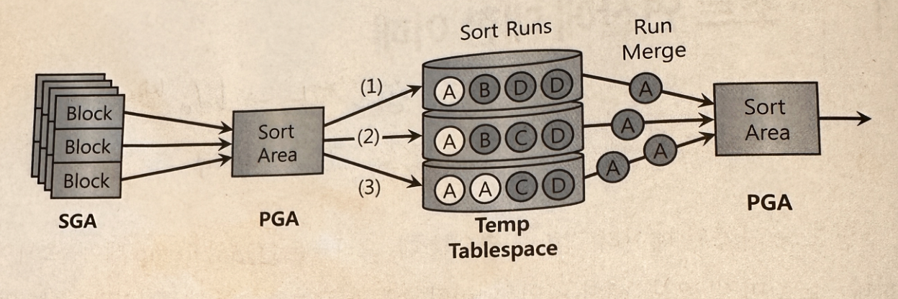
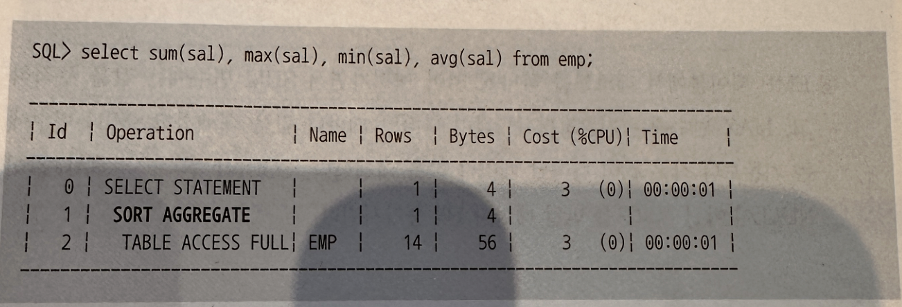

## 5.1. 소트 연산에 대한 이해
### 5.1.1 소트 수행 과정
- 오라클 서버 프로세스는 SGA(System Global Area)에 공유된 데이터를 읽고 쓰면서, 동시에 자신만의 고유 메모리 영역인 PGA(Private Global Area)를 갖는다.

- SGA
  - 모든 사용자가 공유 가능하여 사용
- PGA
  - 사용자마다 공유하지 않고 개별적으로 사용
- 소트는 PGA에 할당한 정렬 공간에서 이루어짐. 정렬 공간이 차면 디스크 Temp 테이블스페이스를 활용
- 메모리 소트(In-Memory Sort)
  - 전체 데이터의 정렬 작업을 메모리 내에서 완료하는 것
- 디스크 소트(To-Disk Sort)
  - 할당받은 정렬 공간 내에서 정렬을 완료하지 못해 디스크 공간까지 사용하는 경우

### 디스크 소트 과정

1. 소트할 대상 집합 SGA 버퍼캐시를 통해 읽기
2. Sort Area에서 정렬 시도
3. Sort Area 내에서 데이터 정렬을 마무리하거나 양이 많을 때는 정렬된 중간집합을 Temp 테이블’ 스페이스에 임시 세그먼트를 만들어 저장(이때, Temp 영역에 저장해 둔 중간 단계의 집합을 ‘Sort Runs’이라 함)
4. 정렬된 최종 결과집합을 얻기 위해 Merge
   - 소트 연산 -> 메모리 집약적, CPU 집약적
   - 처리할 데이터량이 많을 경우 디스크 I/O까지 발생하므로 쿼리 성능을 좌우하는 중요한 요소
   - 디스크 소트는 부분범위 처리를 불가능하게 함으로써 OLTP 환경에서 애플리케이션 성능 저하시키는 주요인
     - 소트가 발생하지 않도록 SQL 작성, 소트가 불가피하다면 메모리 내에서 수행 완료할 수 있도록
      한다.

### 5.1.2 소트 오퍼레이션
#### Sort Aggregate
- 전체 로우를 대상으로 집계를 수행할 때 나타남
- Sort 표현을 사용하지만 실제로 데이터를 정렬하지 않는다. Sort Area를 사용한다는 의미!

#### 데이터를 정렬하지 않고 SUM, MAX, MIN, AVG 값 구하는 과정
1. Sort Area에 SUM, MAX, MIN, COUNT 값을 위한 변수 할당
2. EMP 테이블 첫번째 레코드에서 읽은 값을 변수에 저장, COUNT 변수에는 1 저장
3. EMP 테이블에서 레코드를 하나씩 읽어가면서 SUM 변수에 값 누적, MAX 변수에는 기존보다 큰 값 나타나면 대체, MIN 변수에는 기존보다 작은 값 나타나면 대체, COUNT 변수에는 값이 NULL이 아닌 레코드를 만날 떄마다 1 증가
4. EMP 테이블을 다 읽고 SUM, MAX, MIN 값은 그대로 출력, AVG는 SUM 값을 COUNT 값으로 	   나눔
#### Sort Order By
- 데이터 정렬할 때 나타남
#### Sort Group By
- 소팅 알고리즘을 사용해 그룹별 집계 수행할 때 나타남
- EMP 테이블에서 부서코드(10, 20, 30, 40)별로 급여 집계
- 사진 추가 에정

1. 부서코드별로 SUM, MAX, MIN, COUNT 변수 할당
2. 각 사원의 급여 정보를 읽어 각 사원의 부서번호에 해당하는 부분을 찾아 SUM, MAX, MIN, COUNT 값 갱신
3. Sort Aggregate에서 사용했던 방식과 똑같이 수행
> 부서가 많지 않다면 Sort Area가 클 필요 없음. 집계할 대상 레코드가 많아도 Temp는 쓰지 않는다!

#### * Hash Group By *
- 오라클 10gR2 버전에 도입된 방식
- Group By 절 뒤에 Order By 절을 명시하지 않으면 Hash Group By 방식으로 처리
- 소트 알고리즘이 아닌 해싱 알고리즘을 사용
- 읽는 레코드마다 Group By 컬럼의 해시 값으로 해시 버킷을 찾아 그룹별로 값을 갱신.
#### ※ 그룹핑 결과의 정렬 순서 ※
- 오라클은 그룹핑 결과가 정렬 순서를 보장하지 않는다고 공식적으로 밝혔음
- 실행계획에서 ‘Sort Group By’의 의미는 소팅 알고리즘을 사용해 값을 집계한다는 뜻일 뿐 결과의 정렬을 의미하지 않는다. 쿼리에 Order By 절을 명시했을 경우에는 정렬 순서가 보장된다. 
- 이때도 실행계획에는 ‘Sort Group By’로 표시되므로 실행계획만 보고 정렬 여부 판단 X
- 즉, 정렬된 그룹핑 결과를 얻고자 한다면 반드시 Order By 명시!
#### Sort Unique
- Unnesting 된 서브쿼리가 메인 쿼리와 조인하기 전에 중복 레코드를 제거할 때 나타남.
- PK/Unique 제약 또는 Unique 인덱스를 통해 Unnesting 된 서브쿼리의 유일성이 보장되면, Sort Unique 오퍼레이션 생략
- Union, Minus, Intersect 같은 집합 연산자, Distinct 연산자 사용할 때도 나타남
#### Sort Join
- 소트 머지 조인 수행할 때 나타남
- 사진 추가
#### Window Sort
- 윈도우 함수(=분석 함수)를 수행할 때 나타남
- 윈도우 함수
  - 행과 행간의 관계를 쉽게 정의하기 위해 만든 함수로 순위함수(RANK, DENSE_RANK, ROW_NUMBER)와 집계함수(SUM, MAX, MIN, AVG, COUNT) 와 같은 함수를 말한다
