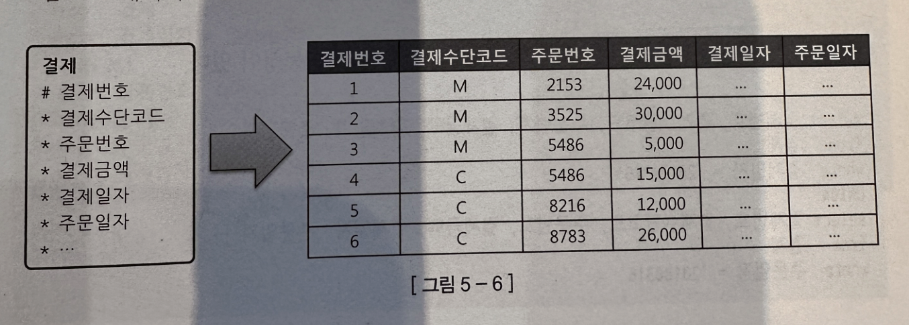
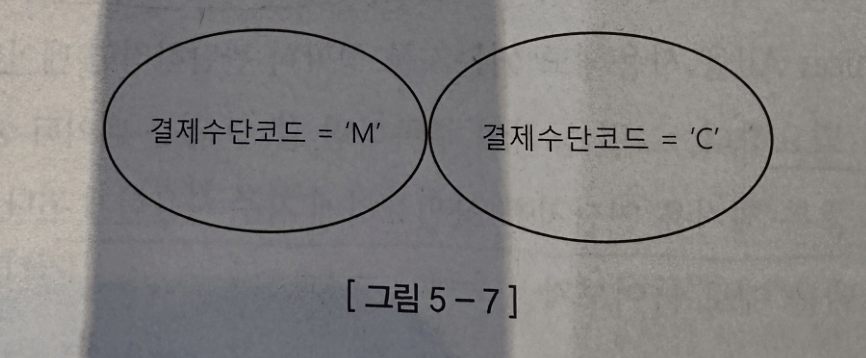
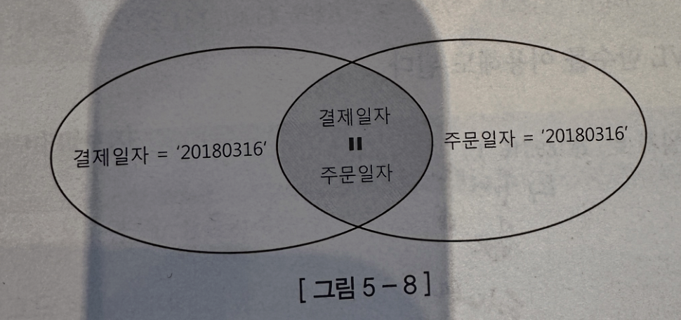
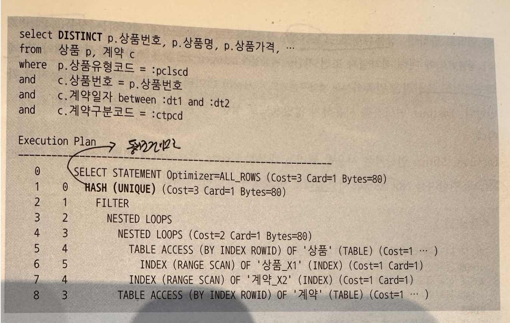
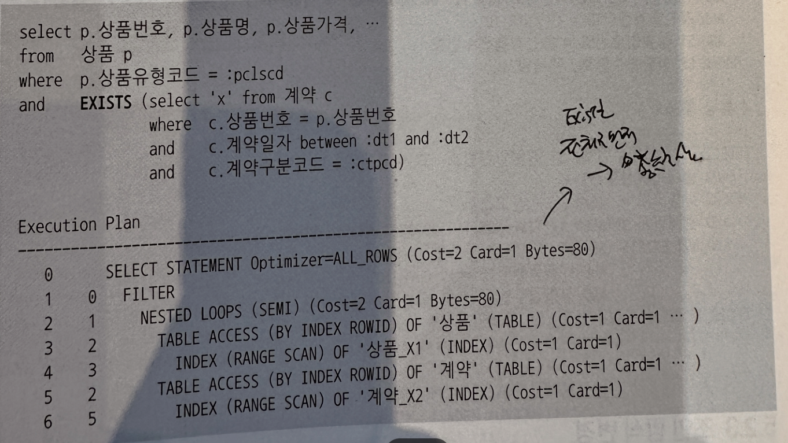
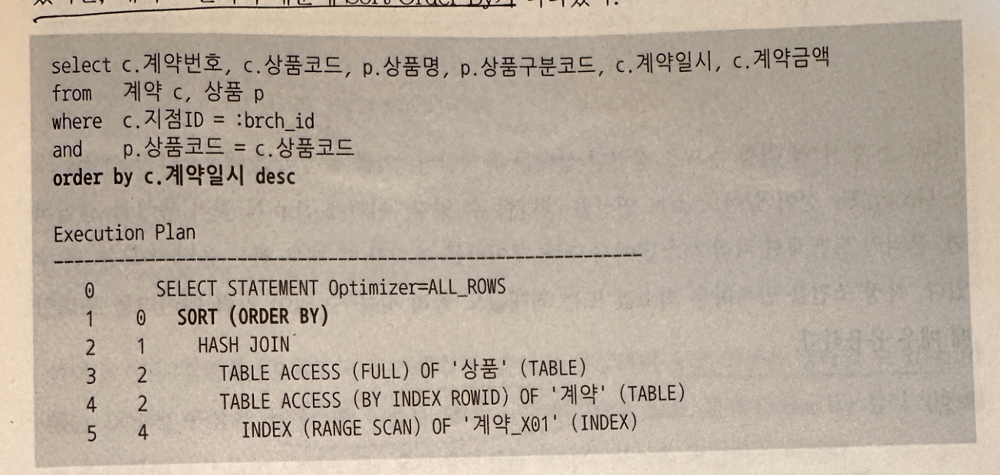
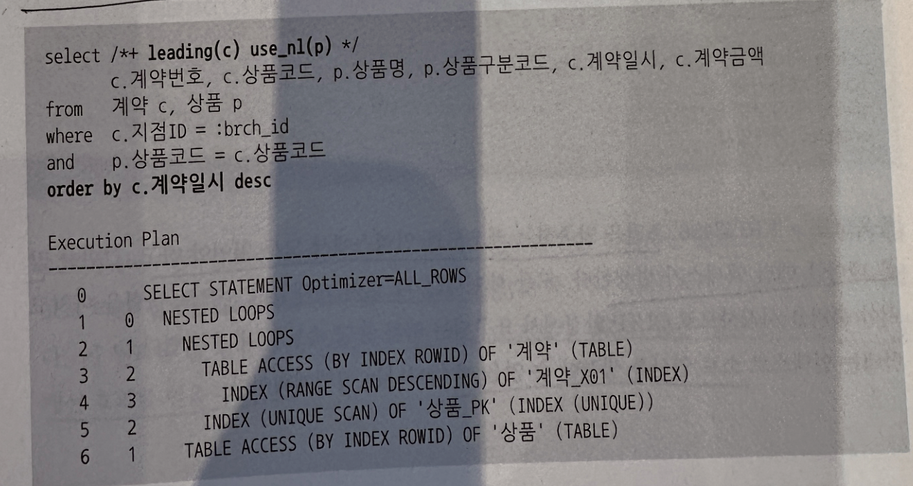

## 5.2. 소트가 발생하지 않도록 SQL 작성
### 5.2.1 Union vs Union All
- SQL에 Union을 사용하면 옵티마이저는 상단과 하단 두 집합 간 중복 제거 위해 소트 작업 수행. 
- 반면, Union All은 중복 확인하지 않고 두 집합 단순히 결합하므로 소트 작업 X
- 따라서 될 수 있으면 Union All을 사용! 
- But, Union을 Union All로 변경하려다가 결과 집합이 달라질 수 있으므로 주의

- 결제수단코드 조건절에 다른 값을 입력했기 때문에 상단과 하단 집합 사이에 중복 가능성 X
- Union을 사용함으로 인해 소트 연산 발생!
> 상호배타적이므로 Union 대신 Union All 사용가능!!!

- 이 쿼리는 상단과 하단 집합 사이에 중복 가능성 O
- 사진 추가 예정
- 결제일자와 주문일자 조건은 상호배타적 조건이 아니기 때문에 Union을 Union All로 변경하면, 결제일자와 주문일자가 같은 결제 데이터 중복 출력

> 소트 연산이 일어나지 않게 하고, Union All을 사용하여 데이터 중복을 피하려면 이와 같은 쿼리 사용

### 5.2.2 Exists 활용
- 중복 레코드를 제거하려고 Distinct 연산자를 사용하면 모든 데이터를 읽어서 중복 제거해야 하므로 부분범위 처리 불가능, 모든 데이터를 읽는 과정에 많은 I/O 발생

- 상품유형코드 조건절에 해당하는 상품에 대해 계약일자 조건 기간에 발생한 계약 데이터 모두 읽는 비효율 발생

- 쿼리를 이렇게 바꾸면 상품유형코드 조건절에 해당하는 상품에 대해 계약일자 조건 기간에 발생한 계약 중 계약구분코드에 만족하는 데이터가 존재하는지만 확인
- Distinct 연산자 사용하지 않았으므로 상품 테이블에 대한 부분범위 처리도 가능
* Minus 연산자는 위와 동일한 방식으로 Not Exists 서브쿼리로 변환해서 사용 가능

### 5.2.3 조인 방식 변경
- 조인문일 떄는 조인 방식을 잘 선택해야 함.

- 계약_X01 인덱스를 타게 되면 소트 연산 생략할 수 있지만 해시 조인이기 때문에 Sort Order By 실행계획 나타남

- leading(c) use_nl(p) 힌트를 사용하여 계약 테이블을 기준으로 상품 테이블과 NL조인하도록 조인 방식을 변경하면 소트 연산을 생략할 수 있음